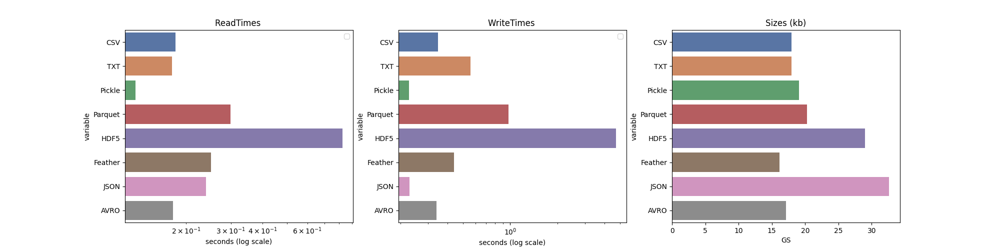

# Assignment 1 Subtask 1

## File Types

#### 1. CSV
    a. A CSV (Comma-Separated Values) file is a plain text file that stores tabular data
    (numbers and text) in plain text form, with each line representing a row of data and
    each field (or column) separated by a delimiter, commonly a comma.
    
    b. CSV files are not designed for efficient random access. If we need to access data at a
    specific location, we may need to read the file sequentially until we reach the
    desired position.
#### 2. TXT
    a. Regarding "txt" files, it typically implies plain text files without a specific structure or
       standardized format.
#### 3. Pickle
    a. Regarding "pickle" files, the pickle module allows us to serialize and deserialize
       Python objects, storing them in a “binary” format.
#### 4. Parquet
    a. Parquet is a columnar storage file format commonly used for big data processing
       frameworks like Apache Spark and Apache Hive.
#### 5. HDF
    a. HDF5 files have a hierarchical structure, allowing efficient complex data organization.
       This structure enables quick access to specific datasets or groups within the file.
#### 6. Feather
    a. Like Parquet, Feather uses a columnar storage format, where data from the same
       column is stored together. This facilitates fast and efficient access to specific columns,
       making it suitable for analytical queries.
#### 7. JSON
    a. JSON (JavaScript Object Notation) is a lightweight data-interchange format that is
       easy for humans to read and write and for machines to parse and generate.
#### 8. AVRO
    a. Apache Avro is a binary serialization format developed within the Apache Hadoop
       project. It is compact, fast, and designed for efficient data serialization.

## Read and Write time Analysis

#### 1. CSV

    a. Reading and writing operations in CSV files are generally efficient because the format
    is simple, and data can be sequentially processed line by line.
    
    b. Reading a CSV file involves parsing each line and splitting it based on the linear
    operation of the delimiter.
    
    c. Writing to a CSV file is also straightforward, as you can append lines to the file one at
    a time.

#### 2. TXT

    a. Reading and writing operations in plain text files are generally efficient. Operations
    involve the sequential processing of lines.

    b. Reading a text file typically involves reading each line one at a time, making it a
    linear operation.
   
    c. Writing to a text file is straightforward, as data can be appended or modified
    sequentially.

#### 3. Pickle

    a. Pickling (serialization) and unpickling (deserialization) operations can be time-
    efficient for complex data structures and objects.
    
    b. Pickle files are binary, and the serialization process captures the internal structure of
    Python objects, including their state.

#### 4. Parquet

    a. Reading and processing specific columns is faster than row-based storage formats
    like CSV or plain text.

#### 5. HDF

    a. HDF5 supports chunking, a mechanism where data is stored in fixed-size chunks. This
    can improve read and write performance, especially when working with large
    datasets, as it allows for selective access to specific parts of the data without reading
    the entire file.

#### 6. Feather

    a. Feather is designed to be a lightweight and fast serialization format. The binary
    format allows for rapid serialization and deserialization of data, contributing to
    efficient read and write operations.

#### 7. JSON

    a. Parsing JSON is a linear operation, making it efficient for reading and writing small to
    moderately sized datasets.

#### 8. AVRO

    a. Avro uses binary encoding, contributing to faster serialization and deserialization
    than text-based formats like JSON. This is especially beneficial for large datasets and
    high-throughput scenarios.

## Space and Storage Analysis

#### 1. CSV

    a. CSV files are relatively space-efficient because they store data in a simple text format
    without additional overhead.
    
    b. Compared to binary formats, CSV files may occupy more space due to the human-
    readable nature of the format and the inclusion of text-based delimiters and quotes.

#### 2. TXT

    a. Like CSV files, plain text files are not optimized for efficient random access. If random
    access is required, reading the file sequentially may be necessary.
    
    b. Plain text files are generally space-efficient because they store data in a simple,
    human-readable format without additional formatting overhead.
    
    c. However, the lack of a standardized structure means that the space efficiency can
    vary based on how the data is organized within the file.

#### 3. Pickle

    a. pickle files are more suitable for random access than plain text or CSV files. Since the
    file contains a serialized representation of objects, you can selectively load specific
    objects without reading the entire file.

    b. Pickle files can be more space-efficient than plain text files because the binary
    format is more compact.
    
    c. The serialized format includes information about the object's structure, allowing for
    efficient representation of complex data types.

#### 4. Parquet

    a. Parquet files store data in a columnar format, meaning values from the same column
    are stored together. This can lead to significant performance improvements,
    especially for analytics and queries that select specific columns.
    
    b. The columnar storage format of Parquet files contributes to space efficiency by
    reducing the storage required for duplicate values within a column.

#### 5. HDF

    a. The chunking mechanism in HDF5 improves time efficiency and can contribute to
    space efficiency. It allows for efficient storage of large datasets by breaking them into
    manageable chunks.
    
    b. HDF5 allows the creation of virtual datasets, defined as references to data stored
    elsewhere in the file. This feature supports efficient storage and organization of data
    without duplication.

#### 6. Feather

    a. Like Parquet, Feather uses a columnar storage format, where data from the same
    column is stored together. This facilitates fast and efficient access to specific columns,
    making it suitable for analytical queries.
    
    b. The columnar storage format of Feather contributes to space efficiency by reducing
    redundant storage of similar values within a column.

#### 7. JSON

    a. JSON is relatively quick to serialize (convert objects to JSON format) and deserialize
    (convert JSON format to objects) due to its simple and text-based structure.
    
    b. JSON is a text-based format, so it may not be as space-efficient as binary formats.
    Text-based formats tend to have more overhead due to the inclusion of characters
    like curly braces, colons, and quotes.

#### 8. AVRO

    a. Avro's binary format is designed to be compact, resulting in smaller file sizes
    compared to text-based formats. The compactness is achieved through efficient
    encoding of data types and minimal metadata overhead.

## Graph

### RISHIT JAKHARIA
